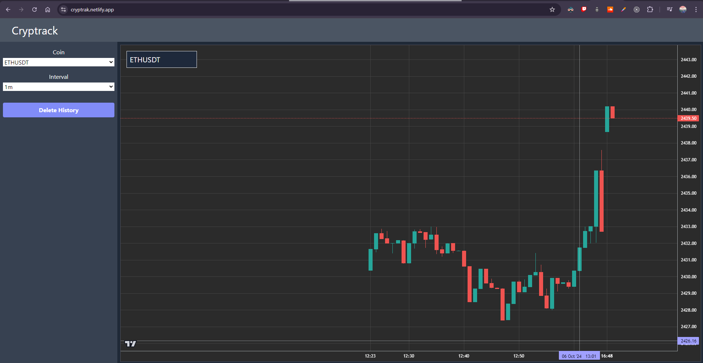

# CRYPTRACK - Binance Web Socket API Crypto Tracker

### Deployed Link - [https://cryptrak.netlify.app/](https://cryptrak.netlify.app/)



## Features

- **Real-time** crypto price updates on candlestick charts using Binance Web Socket API
- **Filter** options to filter data based on symbol, and interval


1. Cryptocurrency Toggle: A selection dropdown for the following coins:
   - ETH/USDT
   - BNB/USDT
   - DOT/USDT

2. Chart Visualization:
   - A live candlestick chart for the selected cryptocurrency.

3. Candlestick Timeframes:
   - Can choose between 1-minute, 3-minute, and 5-minute intervals for the candlestick chart.
4. Data Persistence:
   - local storage for solution to persist the candlestick data for each coin.
   - When the user switches back to a previously selected coin, the chart will be restored with the previously received data.
5. User Interface:
   - A clean and responsive user interface for toggling between ETH/USDT, BNB/USDT, and DOT/USDT and time interval (1 min, 3 min, 5 min).

## Installation

1. Install Dependencies
```bash
npm install
```
2. Run React App
```bash
npm run dev
```
## Libraries Used for Charts

- [Lightweight-charts](https://github.com/tradingview/lightweight-charts) from [TradingView](https://www.tradingview.com/)

